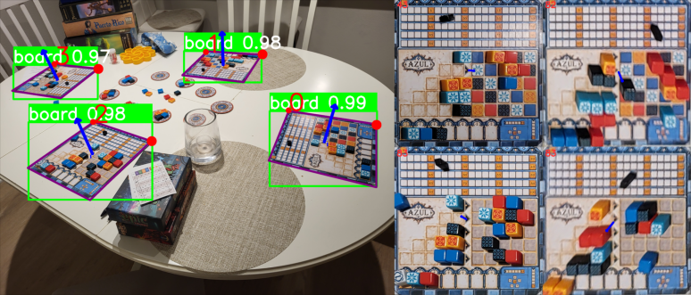
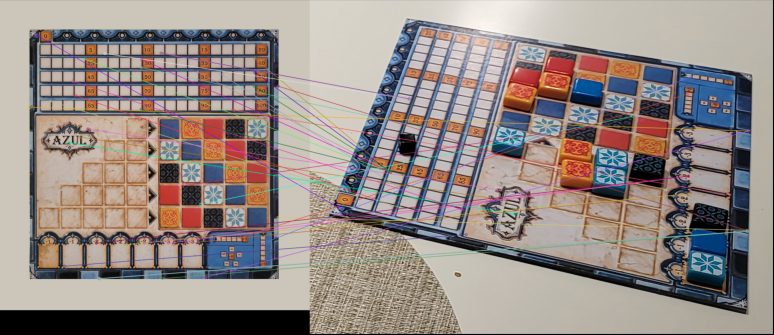
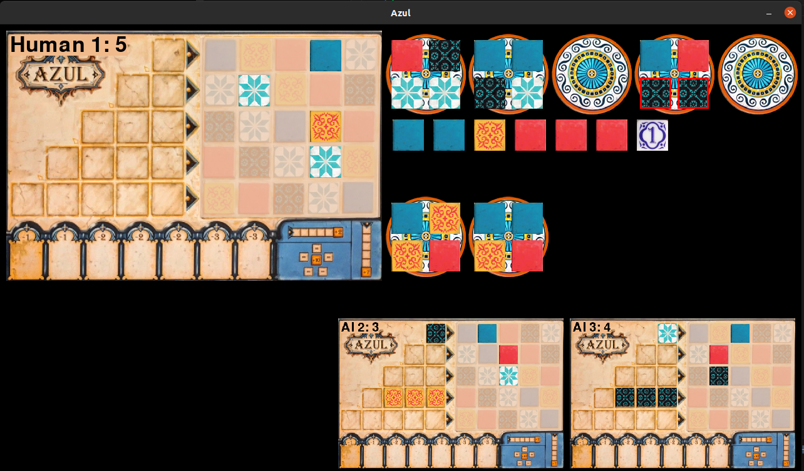

# Azul-Board-Game

*Repository under construction*

## Board Detection 

Game boards are detected in two stages:

1. Image segmentation of the board using YOLO v8
2. Perspective undistort with ORB feature matching against a board pattern

## Game UI

