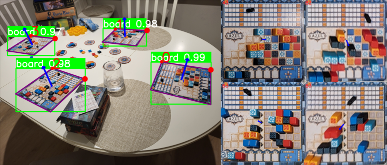
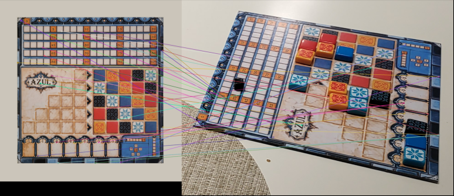
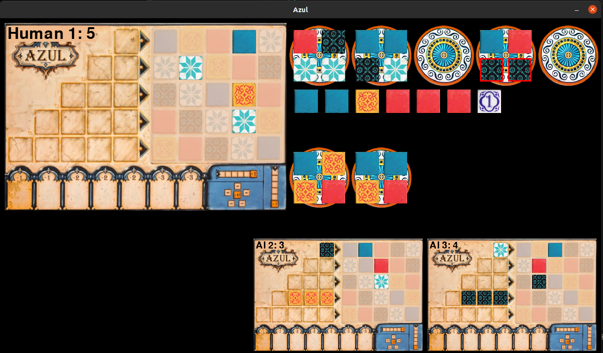

# Azul-Board-Game

*Repository under construction*

## Board Detection 

Game boards are detected in two stages:

1. Image segmentation of the board using YOLO v8
2. Perspective undistort with ORB feature matching against a board pattern

## Game UI

## Play online

The game runs as a web app for invited friends at https://azul.signalwave.dev (server in
`server/`, browser client in `web/`). Publishing and operations: [docs/deploy.md](docs/deploy.md).
Local development: `make test`, `make dev-server`, `cd web && npm run dev`.
